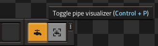
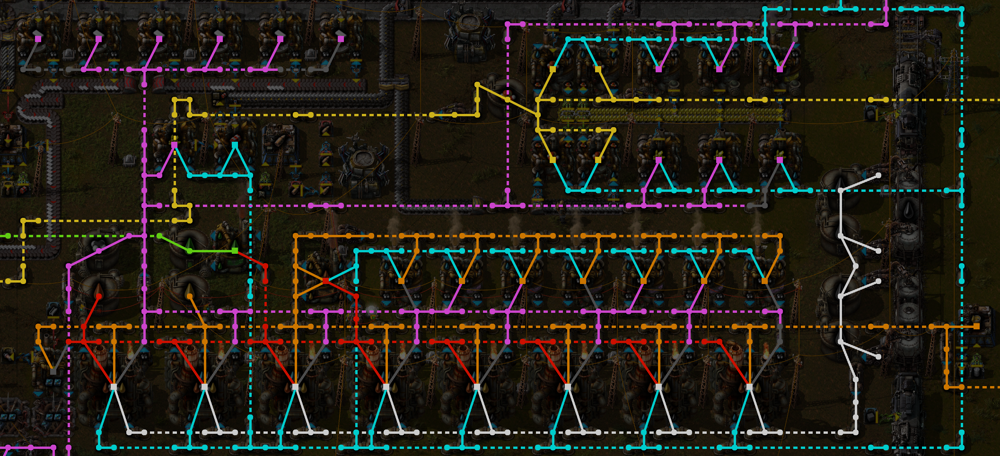
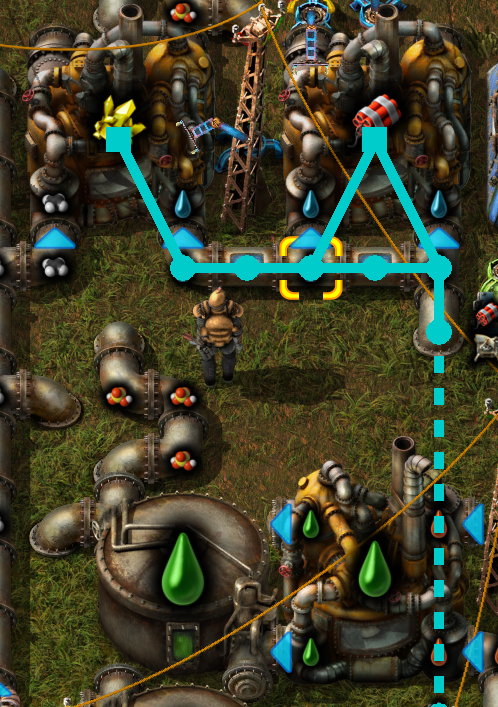

# Pipe Visualizer

Visualize the layout and fluids in Factorio pipe networks.

## Installation

Download on the official Factorio [mod portal](https://mods.factorio.com/mod/PipeVisualizer).

## Features

Toggle the pipe visualizer with `Control + P` or by using the shortcut button. Toggle between coloring by fluid and coloring by fluid system.

Enable the hover-over visualizer to draw fluid systems when you hover over them:

## Credits

Shortcut icons were sourced from [Font Awesome Free](https://fontawesome.com/search?m=free) under the [CC-BY-4.0 license](https://creativecommons.org/licenses/by/4.0/).
